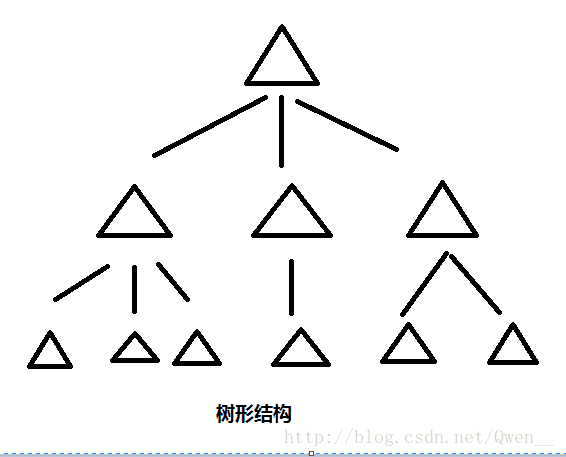
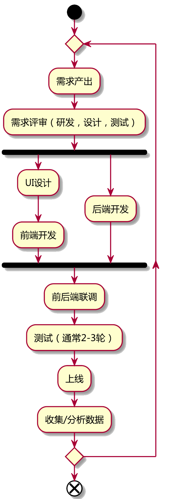

## 问题回答

### 1. 不懂产品开发流程中应该把握哪些关键节点?
这个问题本质是对开发流程的不了解，参考开发流程图。

### 2. 网站优化不懂如何下手？
网站优化包含两方面：技术优化和产品优化。

#### 技术优化：

* 前端优化
  * 页面加载速度优化
  * 交互流畅度优化
* 后端优化
  * 后端服务响应速度优化
  * 数据库优化
  * 服务承载量级提升

#### 产品优化：
* 界面优化
* 交互逻辑
* 业务逻辑

### 3. 怎样审核好自己的需求，不要有漏洞包括细节？
* 建议1：画出产品流程图和交互逻辑图。
* 建议2：根据以上两张图把完整的使用流程自己模拟三遍。
* 建议3：**开需求评审会(important)，一会解千愁**

### 4. 做风控产品pm和平台产品pm相比较优缺点是什么？您怎么看待风控pm，更倾向哪一个呢？
我理解风控更像技术中的测试人员，专门对付各种产品漏洞。平台PM则属于正常的开发人员，在能力锻炼上可能从平台入手更能锻炼自己的做产品能力，尤其培养对用户的把握。

### 5. 产品经理需要了解的技术知识有哪些？
一丢丢技术名词。参看ppt的技术名词解释。

### 6. 平时有学习sql，是否会提升工作中的数据分析的效率？有没有更好的方法？
不需要学习sql。有个可视化数据分析工具叫`tableau`，不需要会编程。

### 7. AI产品经理所需要的技术技能有哪些？需要掌握到怎样的程度？
不需要懂技术怎么实现，需要懂技术能实现些什么。

### 10. 后台、数据库相关、前端、mobile 和PC需要了解的技术知识不一样，侧重哪方面的分享呢？
本次分享并不是专门讲解技术，而是解决PM跟技术之间的矛盾的。

### 11. 问开发什么时候能做完这个功能，开发说看时间吧，看情况吧，应该怎么给他们确定一下时间？直截了当地说这个东西要什么时候要？
首先确定，你给出的需求是你们一起确定了的，还是你跟开发提到了但是没有最终确定的。第一种情况，按正常的排期流程走，第二种情况就先跟开发确定最终需求，然后再进行排期。尽量避免，你给开发确定时间的状况，除非有优先级高的紧急任务，这个时候务必说明情况，沟通清楚。

### 12. 和开发小兵沟通好，明明活已经做完了，可是开发老大就说还有问题，需要再弄一下，此时若说已经和**沟通好了，感觉像出卖了开发小兵，应该怎么和开发老大沟通？
多数情况下，可能下属有考虑没有特别全面的状况，此时先询问一下需要修改什么问题，大致需要多少时间，这里让开发给出明确的回复，然后评估对排期计划的影响大小，如果影响较大将此问题反馈给自己的上级。

### 13. 有的功能需求可以实现，但是自己公司的开发由于技术不足就说不行，但是已经从其他做开发的朋友那里了解到此功能可以实现，此时应该如何和开发沟通，让他们愿意去实现我们提出来的需求？
通常无法实现有两种情况：

1. 要实现功能相比现有技术人员能力完全无法完成。
2. 实现难度有，但实现成本太高。比如：在其他公司同样需求一周开发完毕，在你们公司需要一个月，公司层面是否能够接受？这种情况比较常见。

### 14. 如何给开发进行时间排期，或者对于开发给出的时间排期如何判断合理性？
避免给开发排期。是否合理需要开发人员给出详细的排期计划。请看下面两个例子。

不详细的排期： 首页开发3PD，登录注册3PD。这种排期方式根本不知道合理不合理。

详细的排期大概这样子：

* 首页
  * UI开发 1PD
  * 轮播组件 0.5PD
  * 兼容性完善 1PD
  * 接入后端API 0.5PD

### 15. 如何规避需求评审开发不提任何意见，实际开发过程中提出有难度的情况？
这个问题无法完全避免，的确有些问题在做的过程中才会发现。但是在需求评审的时候，如果研发比较沉默，PM应主动询问研发人员是否有疑问或者难点，这样可以减少这种情况出现。

### 16. 如何提系统性能需求？
一般性能需求都是技术自己提出的。PM提出的性能需求通常有两类：
* 交互卡顿。
* 网站/APP访问速度慢。

这两个问题都可以让前端先排查。第一个问题是前端问题。第二个问题是综合问题，原因可能有很多，可以从前端开始排查是谁的问题。

### 17. 感觉现在部门大部分都是技术，现产品经理的工作也有一部分技术工作，是不是技术是产品经理的必备？
当然不是。不知道你指的有一部分技术工作具体是什么？

### 18. 基础一点的技术可以分享一下吗？
这次分享不会涉及。

### 19. 数学不好可以学技术么？
没问题的。相比数学，逻辑思维更重要。

### 20. 如何操作数据库？

增删改查，基本操作

万一删库，立马跑路

### 21. 如何衡量需求的可实现性和难度？
这个衡量通常是研发人员去衡量的。衡量因素有很多：当前技术架构，研发人员技术能力，项目是否需要，公司经费，时间成本等等。

### 22. 如何利用python做数据分析？
这个问题太大了。建议找个公开课看看。

### 23. 想知道小程序与App的区别，举一些实例说明小程序实现不了（只有App才可以实现的）的问题
APP如果是个楼，小程序就是一间房子。小程序有的功能，APP一定有，反过来不一定。

小程序无法实现举例：
* 全屏视频（像抖音）上面增加客服/转发按钮等。
* 手机上的游戏跟小程序游戏的差距。

### 24. 产品经理日常需要与哪些部门对接呢？
主要对接的岗位有：设计师，运营，前后端开发，测试。
你负责的产品不同，对接的部门可能不同。比如你做的是财务产品，就要跟财务部门对接。这个问题没有确定答案。

### 25. 做一个项目周期大概多长？
具体情况具体分析。

### 26. 需求等被diss了，改动后需要重新组会评估吗？
当然需要。这就好比你要去天安门，结果你坐车坐到长城去了，你的路线用不用重新规划？

### 27. 数据产品经理和b/c端产品经理工作职能的区别？
数据产品经理的重点首先是数据，其次才是产品经理，对能力的要求是首先要很懂数据相关工作，其次是要懂做产品。
而b/c端的产品经理首先要求要懂做产品，对数据相关工作的要求没那么高。

打个比方：汽车的产品经理不用懂发动机怎么制造的，只要知道这个发动机能产生多少功率就可以，但是发动机的产品经理你就必须懂发动机怎么工作的了。

### 28. 如何快速了解所在团队的技术优势与技术壁垒
多和你们的技术负责人沟通。

### 29. 懂技术的产品经理与不懂技术的产品经理思维上有哪些差异？
懂技术的PM优势：可能会提前规避掉一些技术上无法实现的功能，并且通常产品逻辑更加严密。

懂技术的PM劣势：思维可能会太理性化，经常从逻辑推演的角度去分析用户需求。但实际上用户的需求也需要去感受。

### 30. 2b和2c产品侧重的技术有什么区别？
这个问题太宽泛。但是通常2b对系统的安全性和稳定性要求很高，所有企业都怕出问题。2c的对用户体验要求非常高。

### 31. 新人产品最容易被技术diss的都有什么？
1. 无法回答为什么要做这个需求。
2. 需求不清晰，逻辑错误太多。
3. 不相信研发(不论是估算的工时还是能否实现)。

### 32. 如何快速系统学习产品需要的最少必要技术知识？
参考技术词汇表。

### 33. 前期原型阶段怎样设计原型和需求文档怎样书写会适合技术框架？
本末倒置了。技术框架应该去适应产品需求。

### 34. sql需要深入学吗？
不需要。

### 35. 程序员之间沟通的行业黑话？
老婆：下班回来记得买两个馒头，如果看见有卖瓜的，就买一个。
老公下班回家拿了一个馒头。

### 36. 在和程序员沟通中要注意哪些东西
跟第31个问题相似。

### 37. 如何识别产品可行性
让研发人员判断。

### 38. 不同技术所需要的工期
让相应岗位的研发去估计。

### 39. 举例说明一个项目的生命周期，并说明生命周期中那个步骤产品经理扮演的角色。

项目的生命周期，参考项目流程图。

如果PM也兼职了项目管理的角色，起主要作用在开发前（需求阶段）和开发后（测试阶段）。

测试阶段要特别注意的原因是PM要在此阶段确认研发出的产品是否与自己设计的产品一致，由于研发和测试都是根据PRD进行工作，有可能同时误解了一些需求。

### 40. 举例说明网站项目架构和移动互联网架构？什么是接口？什么是服务？
接口和服务的解释请看技术词汇表。

目前PC网站/移动网站/APP等架构都可以抽象为下面的情况：

想象一下麦当劳点餐的流程。


```
1. 顾客点餐。（用户与前端交互）
2. 订单发到做饭区。（前端与后端传递数据）
3. 做饭区向仓库获取食材，然后做饭。（后端根据接收到的数据，从数据库读取数据，并返回用户需要的数据）
4. 做好的饭放到取餐区。（前端展示后端返回的数据）
```

### 41. 什么是敏捷开发？
目前互联网圈内使用的多数都是敏捷开发模式。

先从MVP做起，然后不停地迭代更新产品。

像做游戏、操作系统等等大型软件，多数情况无法使用敏捷开发模式。

### 42. 在日常的工作中和生活中，有哪些方式可以锻炼自己的技术？
如果真的是对技术感兴趣的话，可以从最简单的某一个技术开始学习，边学边写代码。

推荐从前端开发入门（因为我是，当然为自己站台）。

实际原因是上手迅速，容易看到效果，然后对自己产生正反馈。

### 43. 如何能够高效的学习技术？
1. 学习路线要清晰。
2. 无他，唯手熟尔。


### 44. 如何将了解的技术和自己的工作结合实际运用？
这个问题要具体情况具体分析，不同的技术和不同的产品结合起来是不同的。

### 45. 如题，产品经理工作中要学习哪些基础知识才不会被研发吊打？
这问题不关乎技术，更多关乎你们的沟通以及有多了解和信任对方。

### 46. 产品经理对于研发不了解的话，如何规划产品进程做好项目管理？
1. 强烈建议先找一个研发问清楚他们的研发流程。
2. 根据上面的研发流程记录每一个步骤要花费的时间和相关的人员。

### 47. 工作过程中如何掌握基本的技术术语，技术边界？
技术术语可以参看技术词汇表。

技术边界不知道你说的是功能上的边界还是性能上的边界？

如果是功能上的边界，这个问题比较宽泛，从前端到后端都可能有瓶颈。举个例子，前端方面可能包括PC网站，移动网站，小程序，IOS APP，Android APP，桌面应用等等，每一个都可能有自己的瓶颈和边界。这个问题除非对某一个端上的技术很了解，否则难以回答清楚。同样的后端也有自己的边界。

如果是性能上的边界，可以分成两个类型：

* 访问速度
  * 前端有关
  * 后端有关
  * 数据库有关
  * 服务器有关
* 访问数量
  * 后端有关
  * 数据库有关
  * 服务器有关

如果想完整掌握这些东西，需要很系统的学习。

### 48. 不同行业的产品经理的方法论一般有哪些不同？
既然是方法论，应该都是相似的。

### 49. 产品经理一般遇到哪些问题，如何解决？
可以参考第31个问题。

### 50. 互联网产品经理的工作节奏如何？
工作强度较大，需要花很多时间去研究用户，研究自家产品，研究所在行业。

### 51. 埋点怎么设置合理？第三方有推荐的产品吗？
埋点的关键点取决于：你想要收集哪些数据？这些数据如何反应出真实问题？

growing IO做的很好。可惜要花钱。

免费的：百度统计，腾讯统计都可以的。

### 52. 后端开发的专业术语有哪些呢？基本的流程是怎么样的呢？
术语参考技术词汇表。

流程大概这样：


### 53. 测试环境、uat环境、灰度环境到线上，一步步是怎么样实现的？
大体来说就是：

测试环境：测试人员对开发完成的产品进行系统化的功能测试，此时的主要目的是找出产品在开发过程中产生的缺陷（俗称bug）。

uat环境：当上面的测试任务完成之后，会把同样的代码发布到这个环境中，在这个环境中，通常会让PM、同部门的其他同事、普通用户等等都参与使用。目的是确认产品功能是否符合实际的业务需要。

灰度环境：灰度环境实际上就是线上环境。只是在这里有一部分用户用到的某些功能是最新的，而其余用户还是使用的旧版本。目的是收集用户行为数据，去观察新功能是否比旧功能有改进。

### 54. 产品经理在不懂开发技术的时候，如何确保技术是否真的可以做这个功能?
参考第21问。

### 55. 产品经理在接需求的时候，有需求技术达不到，产品经理是当场直接回绝，还是后期整理并说明原因再回绝?
建议整理好原因再回绝，这样对方更能够理解情况，更容易对你产生信服。

### 56. 产品经理和研发发生矛盾后，会怎么解决?
坐下来好好沟通一下，就事论事，在工作中大家都能理解对方。

### 57. 产品经理学的技术不精可以吗
当然可以。

### 58. 数据库和数据表是什么，他们有什么关系？
数据库 = 一个仓库。
数据表 = 这个仓库里的一个货架。
一条数据 = 这个货架上的一个货物。

一个数据库是由很多数据表组成的。
一个数据表又是由很多条数据组成的。

### 59. 程序框架是什么，有什么用处？
1. 框架本身也是一个程序。
2. 框架的目的是让开发者开发效率更高，框架的作用是帮程序员完成了很多基础工作。

比如你在写需求文档的时候，如果已经有了一个需求文档模板，你是不是就省了很多工夫，你要做的就是往这个模板里不断填入自己的内容。

### 60. 编程的数据结构和逻辑结构，想了解一下。

数据结构，顾名思义就是数据的结构。

如果把数据比作水，那么数据结构就是装水的容器。

根据不同的使用目的，会把数据放到各种各样的容器里。

用现实生活中的例子来进行类比，比如：在肯德基里排队点餐，这在程序里面就是队列，特点就是谁先来的，就先处理谁（谁先来就谁先点餐）。

另外一个相反的例子就是：我们往水杯里倒水，我们首先喝到的就是最后倒入的水，这在程序里叫栈，特点是谁后来的，就先处理谁。

以上这两个例子都是基于“集合”，在程序里叫数组。

队列、栈这两种数据结构都属于线性结构，因为它们的特点是集合中的元素之间顺序是有关联性的。

而数组则属于非线性结构，就好比一堆麻将在一起，没有区分先后顺序。

逻辑结构还有另外两种：树形结构和图形结构。

树形结构就像一棵树，数据之间的关联性是像树一样，根只有一个，发展出去的枝叶可以有多个。



树形结构，其实也就是网状结构，想象一下网子就可以了。

之所以有这么多区分是因为数据之间的关系不同。

### 61. 最新的技术都要了解吧，比如大数据，AI了解到什么程度比较合适？有什么好的渠道推荐吗？
最重要的不是去了解这些技术如何实现的，而是去了解这些技术能做什么。

想要了解这些技术能做什么，其中有一个很好的办法就是去看看已有的AI或者大数据产品都有哪些，这些产品实现了什么功能，解决了用户什么痛点。

有个网站 https://www.producthunt.com/ 上面有各种各样的产品推荐。

还有就是多看看互联网相关的新闻，渠道比如36kr，钛媒体等等。

最后，最重要的是可以自己在不懂技术的情况下发挥自己的想象力，比如：如果你拥有所有微信的数据，你能拿来做什么？然后去切换数据源，换成淘宝购物数据等等，这样可以大概明白不同的数据最终能产生的价值非常不同。

### 62. 信息安全和数据隐私方面的技术应该要了解哪些？

信息安全分主要可以分成三类：

* 信息传输类
* 用户信息类
* 数据储存类

这三类需要了解的技术是不同的，是很大很详细的体系。

而数据隐私对于任何公司和用户都是非常重要的。实际上为了能够让隐私数据更加安全的存在，也是要应用到上面的技术。

### 63. 在IT行业工作十年，如果转型作为产品经理，应该能利用什么工具或技术，关注哪些运营数据。
工具是一个表象，重要的是思维。在这个行业这么多年，应该也清楚产品经理具体的工作内容。比如画原型图，不论用Axure或者是墨刀等，实际上最终是要把做产品的思维表达清晰。

而技术方面的话，其实多数问题都在于沟通上面。

运营数据通常都会根据不同需要，建立很多漏斗，每一个漏斗的建立和背后代表的含义是改进产品的重要因素。

### 64. 让技术解决问题时，总是被出现场景不多，被怼，不解决，需要我去网上搜索出现问题原因及解决方案
这个情况我很熟悉，分两方面看：

1. 出现场景不多的问题解决成本如何？
2. 出现的问题到底是技术的问题吗？

第一个问题，可以用统计学来解决，如果你们产品的总用户数量不是特别巨大，而出现问题概率很低，比如：总用户数10万人，出现概率1%，解决成本很高，那可以考虑不解决。

第二个问题，并不是每个问题的出现都是技术上的问题。用户所使用的设备、软件都可能与我们预想的不一样，甚至有些用户在自己没注意的情况下关闭了某些功能，然后会以为是技术问题。这个解决方法是总结一个常见问题列表，然后直接告知用户怎么解决。


### 65. 设计认为我提的问题不专业，怎样提升自己，增强沟通技巧?

我觉得应该问自己两个问题：
1. 你们的产品需要什么样的设计？
2. 设计师的工作流程？

这两个问题思考清楚了，应该困难就不大了。

### 66. 后端开发需要产品写文档，产品应该怎么写？什么形式？
形式是次要的，不论你用图片还是文字，最终目的是要表达清楚产品逻辑。

后端开发更加关心**数据逻辑而非交互逻辑**。下面用用登录/注册来举个例子：

前端关心的：

* 页面上展示哪些内容？输入框和输入提示展示在哪里，展示成什么样子。
* 用户可以进行哪些操作？比如，输入用户名，重置密码，发短信验证码等等。
* 用户的哪些操作需要跟后端交互？比如，点击发送验证码之后需要调用后端接口去发短信。
* 跟后端接口交互的数据格式。

后端关心的：
* 用户注册需要填写哪些内容，如何存放在数据库中，储存过程要进行哪些逻辑校验。
* 用户登录之后的登录状态维护。
* 跟前端交互的数据格式。

在文档上面，通常都是前后端看同一个文档，没有分成两部分的。

如果后端有很多疑惑，很可能是这个文档没写清楚整个业务逻辑。

### 67. 产品对接口应该了解到什么程度？是否应该给开发提供接口应该改哪些字段之类的？
不应该特别关心接口的问题。

不要参与接口设计的事情。

### 68. 产品找开发问这次优化到底改了啥，开发回答一些听不懂的专业语言，产品还是不知道会有什么影响，此时应该怎么控制产品质量？
优化到底改了什么，不用关心过程，只关心结果。比如：网站更快了，更安全了之类的。绝大多数情况下技术上的优化并不会影响现有产品逻辑。

产品质量肯定是测试人员去把控，优化完以后根据影响范围，测试人员再进行测试。

### 69. 教育行业的产品经理工作内容是什么？
差异化很大，有的教育产品是直播上课，有的教育产品是帮助学生写作业，有的是帮助成人学习英语。

整体上有一个共同点：怎么让用户学习得更爽？

### 70. 产品是应该偏重于了解脚本语言的代码编写，还是偏重于系统架构，应该了解的一些系统优化类知识的积累？
重点是你的目的是什么？为了更好的沟通？为了自己能写代码？为了提出系统优化建议？

### 71. 数据和研发在配合的过程中，互相甩锅，产品应该了解哪些知识才能更好的避免这种情况发生？
如果你们的数据收集全部是由自己公司开发的话，你应该了解以下问题：

1. 数据从收集的地方开始（数据埋点）到最终储存下来，中间有多少个环节，都是谁在负责？
2. 数据的同事是否会自己对数据进行处理？
3. 数据和研发争论的问题是什么？这个问题可能在哪个环节？

### 72. 测试会反馈很多问题，在产品研发的过程中，如何合理的利用测试同学的反馈去解决问题？
测试反馈的问题一般有两种：体验问题，缺陷问题。

一般研发人员直接负责的是缺陷问题，就是由于代码的原因导致的产品错误。

体验问题通常是PM应该负责，如果要让研发同学在测试阶段解决体验问题，通常会导致项目时间延长，并且还要再增加测试时间。所以一般不建议这么做。

### 73. 在开发期间，如果需要研发加班赶进度，该如何有效沟通，避免起不必要的争执呢？
这里面有个关键点：
* 项目时间确定以后，要突然加快进度？
* 项目正在计划阶段，想要加快进度？

第一种情况，通常沟通会更加费力气一些，因为这就像接亲的时候突然丈母娘跟你多要两万块钱彩礼似的，一定要很坦诚地说明为何计划有变，需要加快进度的原因是什么？实在不行，给研发同事买瓶饮料啥的，你懂得...

第二种情况，在计划阶段说明情况，让所有人都做到有心里准备，这个事情就比较容易解决了，实在不行一瓶饮料...

### 74. 我们公司是做to B端产品的，技术更希望产品能多以什么方式沟通呢？
沟通方式跟to B和to C的关系不大，只是产品内容上不同。


## 研发流程图



## 一点技术词汇

* 接口/API : 就像功能的开关，比如：开关灯。
* 数据库： 存放数据的仓库。如果数据是水，数据库就是水库。
* 服务：按某种维度划分的功能的集合。比如，去餐厅吃饭，做饭服务的是厨师，上菜服务的是传菜员，接待服务的是接待员等等。往大看，餐厅本身也是一种服务，更高维度的服务；往小看，做饭的厨师还有面点厨师、川菜厨师等等。
* 写死的（静态的）：写在前端代码里的内容，必须通过发布代码才能改变。
* 没写死的（动态的）：内容是从接口获取到的，不需要重新发布代码可以随时改变的，通常会有配套的后端管理系统。
* A/B test：两个版本同时在线，某一部分人只能用到某一个版本。
* URL：找一个网页、一张图片、一个文件等等的地址。
* SDK：功能的集合，就像一个工具箱。
