# css

1. css是干嘛的
2. css怎么使用？语法/子选择器/继承
3. 深入css：盒模型/文档流


## css是什么？

之前我们学习html的时候，学习到html是代表内容以及内容的结构。那么**css就是用来给内容增光添彩，增加样式的**。

css全称英文是 **`Cascading Style Sheets`**, 翻译成中文就是 `层叠样式表`。这个词看起来比较难以理解什么意思，我们不妨先欣赏一幅画：


* 层叠: 图里面有层叠的山峦。对于css来说，层叠指的就是不同内容的层次关系，就像这些山一样。
* 样式：不同的山，有不同的样子，有的山峰是尖的，有的山峰是圆弧的，有的山上有植被。
* 表：写出来的代码看起来很像填好的一张表格。

所以里面关键点有两个： `层叠` 和 `样式`。我们都知道一个网页的内容是由html元素组成的，css就是用来装扮这些html元素的，代表网页的**外观**。

**层叠代表html元素之间的位置关系，上下、左右、远近等等。**

**样式代表html元素自己的样子，大小、颜色、形状等。**


## css怎么用？

### 语法


一条css规则的语法非常简单，核心部分只有3个：选择器，属性，属性值。其他固定的格式有：一对花括号，属性和属性值之间的冒号，每一行属性设置完成之后在行末的分号。

下面分别解释一下含义：

* 选择器：选中要增加样式的html元素。上面这个例子里会选中所有符合选择器的元素。在上面的例子会选中所有的 `p` 标签，无论有多少个都会一起选中。
* 属性：给选中的元素增加哪些样式。上图里的两个属性就是：字体颜色（color）和字体大小（font-size）
* 属性值：需要增加的样式设置的具体内容。上图里 `color` 的值是 `red` ，代表字体颜色设置为红色； `font-size` 的值是 `14px` ，代表字体大小设置为14个像素。

看起来是不是非常简单！

下面我们把css与上一章学过的html结合起来。

### html与css的结合

#### 方法1：


通过上面的代码可以看到，我们在html中插入了一个`style`标签，css的代码是放在`style`标签里的。这样我们就把html与css结合起来了，如果我们把这段代码保存到html文件中，在浏览器中打开以后，就能看到两行文字都变成红色的了。

#### 方法2：

让css文件独立出来，然后在html文件中引入这个css文件。

用这种方式修改之后的代码会变成下面的两段：

html文件中的`style`标签没了，变成了一个`link`标签，引入我们需要的css文件。


这里的css代码被独立放在`01.css`文件中。


以上这种方式的实际效果与第一种方法是一样的，但是多了一些好处：

我们把css代码放在专门的css文件中之后，就意味着这段代码可以被多个html文件引入了，所以聪明的小伙伴就可以把很多通用的样式放在这样一个文件中，然后给多个html文件使用。

而且，通过这种方式，我们还能够使用别人已经写好的样式，同样的我们的样式也可以被别人使用，这就意味着我们可以少做很多重复工作，节约很多时间。

### 多了解一些css选择器

关于css的选择器，刚才我们简单地了解了一些，现在我们会进行更加深入的学习。

上面有这样一段代码：


但是设想一下如果我们有10个 `p` 标签的内容，但是只希望其中某一些段落的字体是红色的，应该怎么办呢？目前上面这段代码会把所有的 `p` 标签字体颜色都设置为红色。

#### css选择器的类型

不只html标签的名字可以作为选择器，html标签上的其他属性也是可以作为选择器的。以下面html代码为例子：


我们看到 `p` 标签上增加了 `class` 这个属性，它的值为 `red`。**`class`属性是可以作为选择器的！**

我们以class作为选择器的话，css代码长这个样子：


可以看到跟之前以标签作为选择器的时候写法略有变化：以class的值作为选择器的话，需要在前面加上 **`.`** 这个符号。

类似的，如果html标签中有 `id` 属性的话，我们也可以使用id作为选择器。当id作为选择器时，前面要加上 **`#`** 这个符号。

代码如下：


#### css选择器的组合

上面多次提到选择器可以是一个组合，那么我们就看看到底什么是组合：

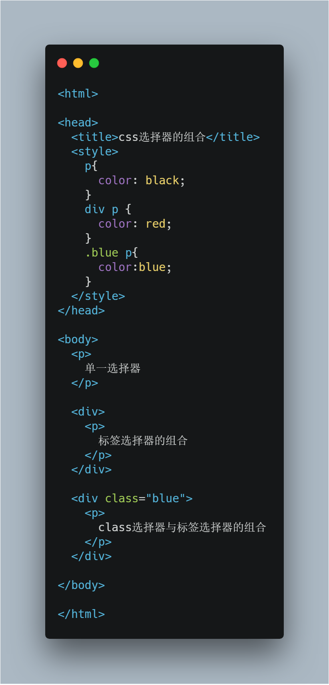

我们可以看到这段代码中，出现了多个选择器排列在同一条规则中，不同的选择器之间由空格进行分割开，代表什么意思呢？

用下面的代码作为示例

```css
div p{
  color: red;
}
```
这里代表先找到所有 `p` 标签，然后再找出父祖级元素中有 `div` 的 `p`。所以在上面的例子里，被命中的元素是第2,3个 `p` 标签。

**注意：这里的命中规则是从右向左哦！！**


效果如下：

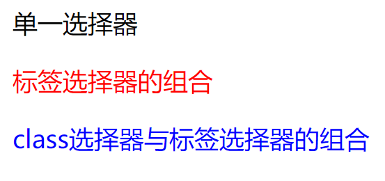

这个时候我们会发现一个问题，上面这个例子中出现了多条css规则都命中同一个元素而且都设置了`color`这个属性，我们看到了最终的效果，但是其中有什么奥秘呢？为了解答这个问题，我们需要学习 **选择器的优先级** 。

#### 选择器的优先级
为了解决上面那个问题，css语言的设计者已经帮我们想好了办法：

**不同类型的选择器拥有不同的优先级，一般情况下，越具体的选择器优先级越高。**

根据w3.org的官方定义优先级是可以用数字来计算的，计算规则如下：

* 计算这一条css规则中id选择器的数量 (= a)
* 计算这一条css规则class选择器的数量, 属性选择器的数量, 伪类选择器的数量 (= b)
* 计算这一条css规则标签选择器和伪元素的数量 (= c) 
* 忽略全局选择器

看看下面的计算示例：

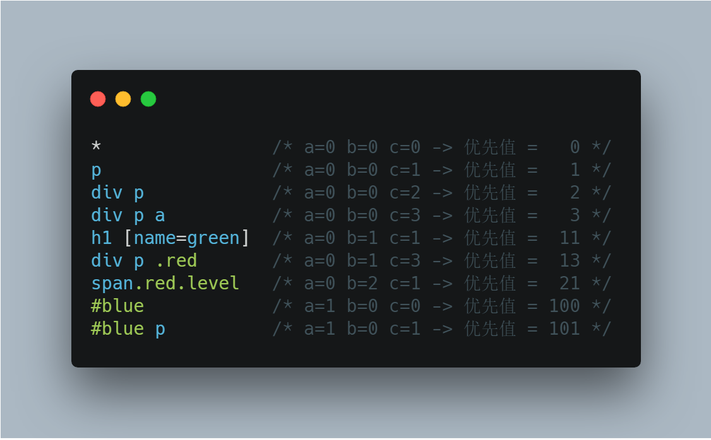

通过这个例子我们可以回顾一下上一小节的代码示例，我们来计算一下每一条css规则的优先值

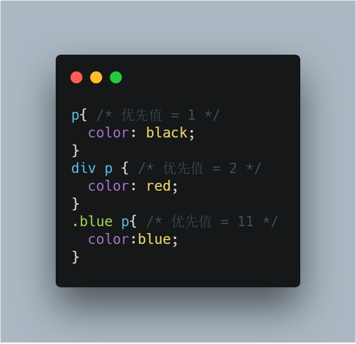

所以最终我们看到的效果是不同的 `p` 标签展示出了不同的样式。

**结论：**

* 在多条css规则设置了同样的属性时，优先级高的规则会覆盖优先级低的规则。
* 如果是不同的属性，则不会被覆盖。


## 深入了解css


### 盒模型（Box Model） 

#### 盒模型的结构

既然叫盒模型，说明这里的内容就跟盒子有关系。在html中，所有的元素都是以长方形为容器进行展示的，小到一个字，大到整个网页。比如我们学过的：`p` `div` `span` 等等，全部都是。但是有的同学会有疑问：网页中并没有看到每个元素都看起来是长方形。

**准确的说是每一个元素的所占据的空间都是以长方形划分的！**

举一个现实中的例子，我们每个人家里都有很多盒子，盒子是容器，它的形状是长方形的，但是盒子里面装的东西可以是多种多样的。在网页里，我们经常看不到这些盒子，更多是看到盒子里的东西。

有一个很好的验证方法，就是我们写一段html代码，然后给所有的元素都加上背景颜色，就能看出来了。

试验代码：

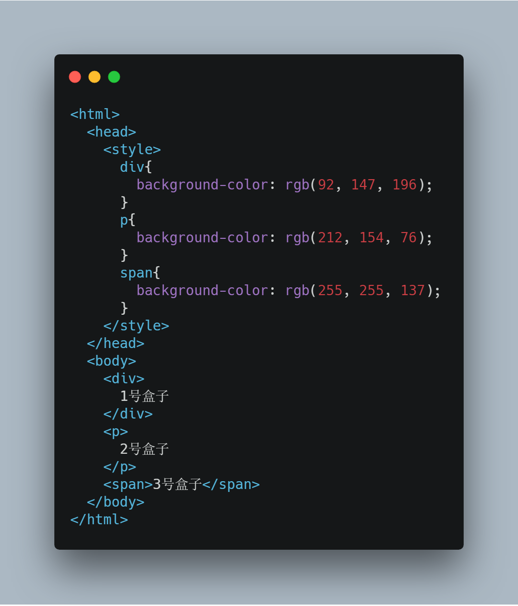

实际效果如下：

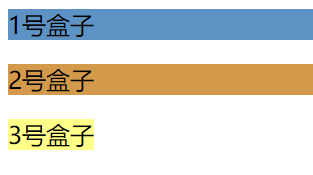

我们会发现第三个盒子比前两个都要短，这是为什么呢？

下面详细地解释一下盒模型的定义：


这幅图代表每一个盒子的结构，下面我从内到外解释一下：

* content：内容区域，相当于盒子中间能放东西的地方。
* padding: 内边距，相当于盒子内放的东西与盒子之间的塑料泡沫。
* border: 边框，就是盒子的壳。
* margin: 外边距，盒子与盒子之间的距离。
* width: 宽度，仅指盒子content区域的宽度。
* height：高度，仅指盒子content区域的高度。

下面我们做个试验：

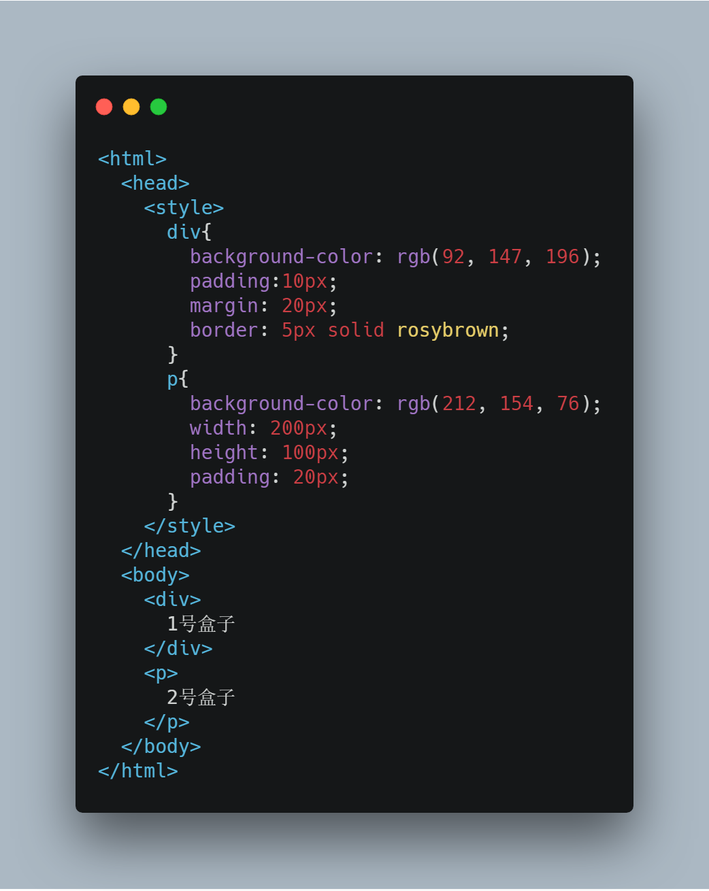

效果如下：

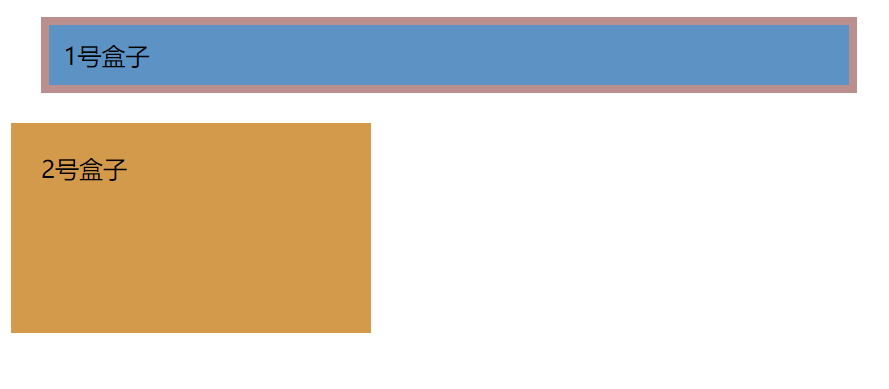

具体每一个属性到底如何影响了一个盒子的展示，希望大家可以自己动手去跟盒子玩起来，去尝试修改上面的代码，看看有什么样的变化。

#### 盒子的不同展示类型

上面介绍了每一个盒子的结构，但是对于不同类型的盒子来说，虽然结构相同，但是展示效果并不相同。在css中通过`display`属性来设置。下面详细介绍三种最常用，也是最基本的display类型。

* block类型: 通过css：`display:block` 设置某个元素为此类型。这种盒子自己独占一行，即使这个盒子的宽度设置小于整行宽度，也会独占一行。
* inline类型: 通过css：`display:inline` 设置。 这种盒子无法独占一行，并且不能设置`width` `height`，并且在垂直方向上的 `padding` 和 `margin` 相关属性是无效的，只能设置在水平方向上的相关属性。
* inline-block类型: 通过css：`display:inline-block` 设置。从名字看就是综合了以上两个类型的特点，这种类型的盒子自己不独占一行，但是却可以设置 `width` `height` 以及全部的 `margin` 和 `padding` 属性。

实际运用中，所有的元素都有自己默认的`display`属性，并不需要我们专门去设置。

比如常见的 `block` 元素有：

```html
div
p
h1
h2
section
form
table
ul
ol
```

常见的 `inline` 元素有：

```html
span
a
b
i
input
button
```

常见的 `inline` 元素有：

```html
span
a
b
i
em
```

常见的 `inline-block` 元素有：

```html
img
button
input
textarea
```

具体的每一种元素的默认`display`类型还需要大家自己多尝试多探索。

#### 盒子的包含关系

了解完三种盒子其实我们会发现inline盒子就像它的名字inline一样，表明了这是一个在一行之内使用的盒子，而block盒子则是比较霸道，不论它的大小，都要独占一整行，而inline-block盒子是处于中间。

所以他们的包含关系基本原则就是大元素可以包含小元素：

```
block > inline-block > inline
```
所以通常来说，block元素可以包含另外两种元素。但是如果都是block元素呢？这就需要我们队每一种元素进行更多的了解，实际上即使都是block元素他们之间也有大小关系，比如：`div`这个盒子可以认为是最大的，任何元素都可以放在它里面，而`p`元素不能包含其他任何block元素，原因就在于`p`元素的含义是文字的段落，所以它的里面只能包含inline-block和inline元素。


### 文档流（盒子如何排列）

上面是讲解了每一个盒子的奥秘，而每一个网页都是由很多个html元素组成的，也就是由很多个盒子组成，所以就必须搞清楚这些盒子之间的排列规律。

实际上每一个盒子也都可以有自己的排列方式，排列的方式主要有三种：

* 正常排列方式
* float方式
* position方式


#### 正常排列方式（normal flow）

首先，我们想象一个网页就是一篇文章，我们回忆一下一篇文章是如何排版的：

* 段落从上向下
* 文字从左到右

盒子的默认正常排列也是依照这个原则进行排列的。

比如：

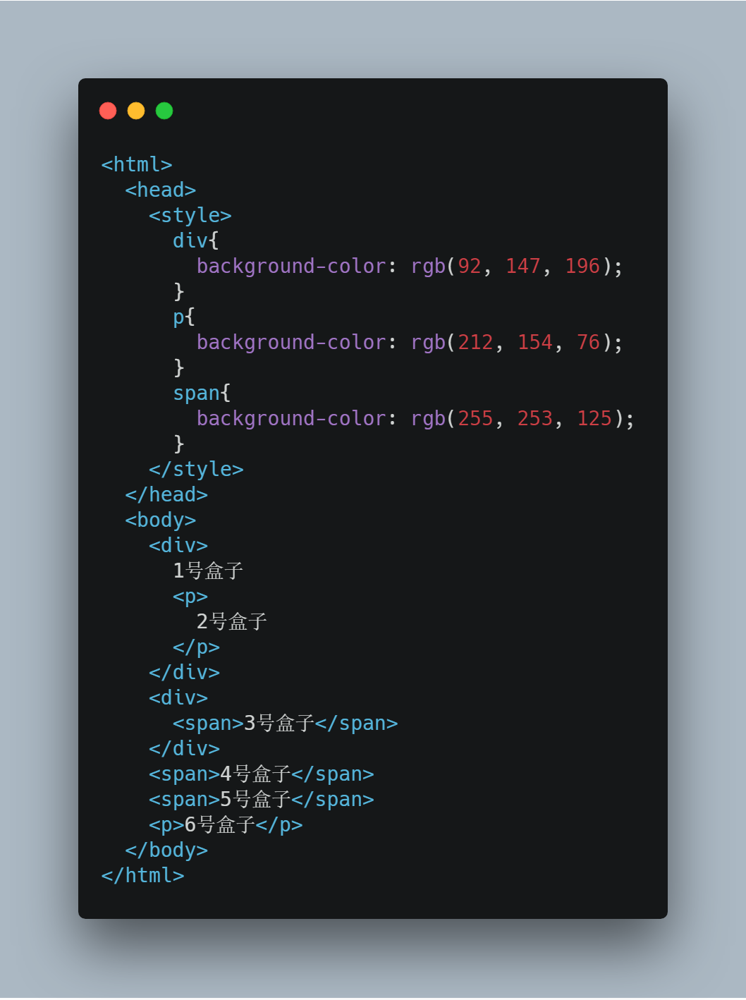

展示出来的结果：

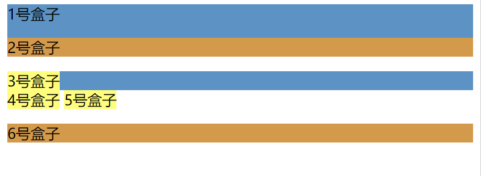


#### float方式

要使用这种方式，需要设置css属性`float`，先使用值为`float:left`举例。

设置这个属性之后，会使某个元素脱离正常的排列方式，会直接浮动到自己的父级盒子的最左边，或者另外一个浮动的盒子。同时可以让其他的inline元素或者文字跟自己排列在一起。

举个例子：

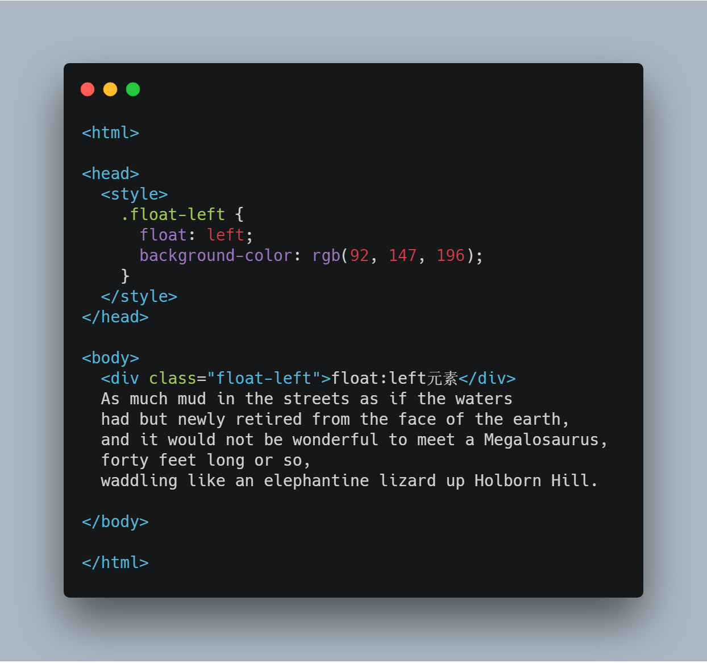

效果：

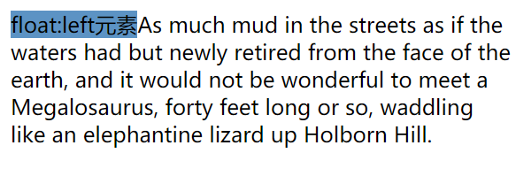

#### position方式

使用这种方式的时候，需要设置css属性`position`，并且取值必须为`absolute`或者`fixed`，才能使元素脱离正常排列方式。

但是与float方式不同的是，该元素脱离正常排列方式之后，会将整个元素的层级提升，还记得之前我们看过的那副山峦层叠的画吗？有的山在前面有的山在后面，使用这个方式就会使得这个元素层级提前。

举个生活的例子，如果把正常排列方式的元素的层次比作桌子，那么设置了position元素的层次就是桌子上的东西，会压住桌子的。

举个例子：

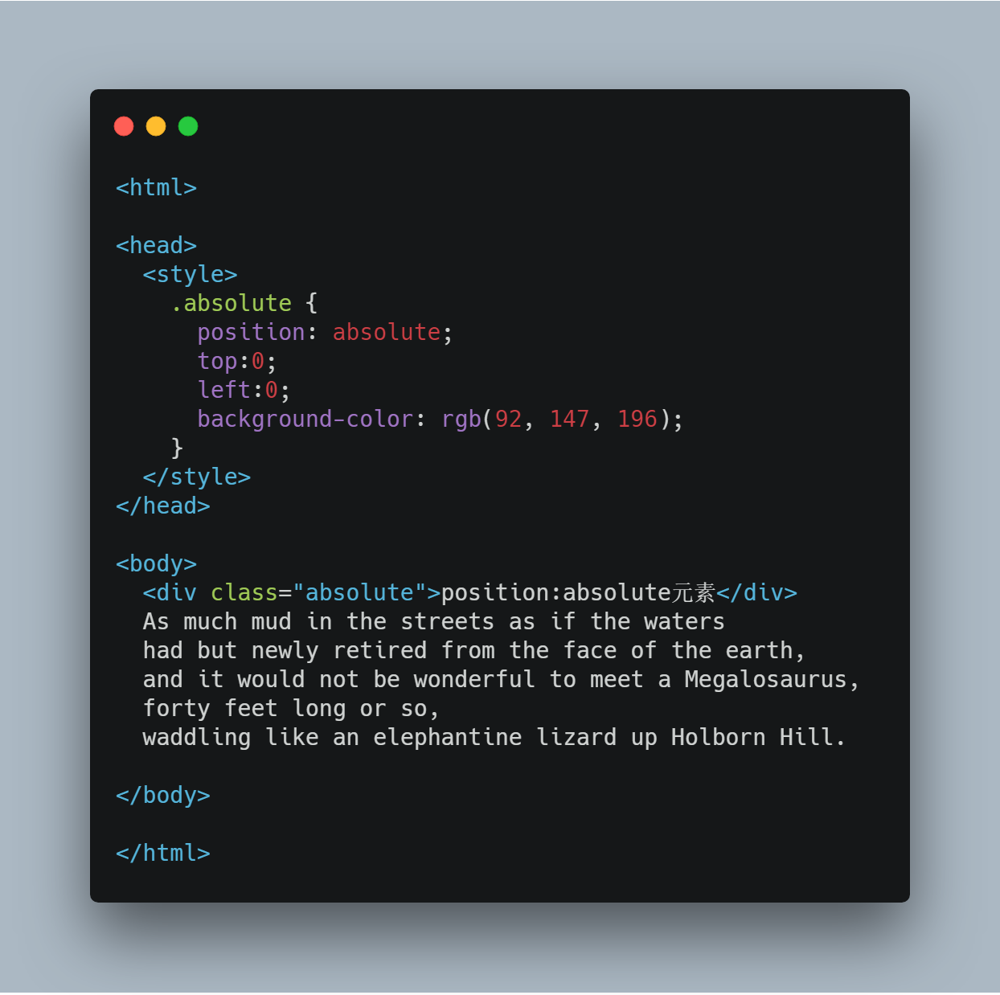

效果：

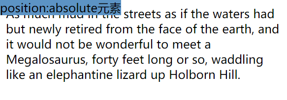

## 总结

1. 所有的html元素都是盒子，盒子从里到外有4层（content,padding,border,margin）
2. 每个盒子最主要的展示类型有三种（block,inline,inline-block）
3. 盒子与盒子之间的排列方式也主要有三种（normal,float,position）

把上面三条总结内容提炼成三个关键问题：

1. 盒子自己的结构
2. 盒子与整个文档的展示关系
3. 盒子与盒子之间的位置关系是什么