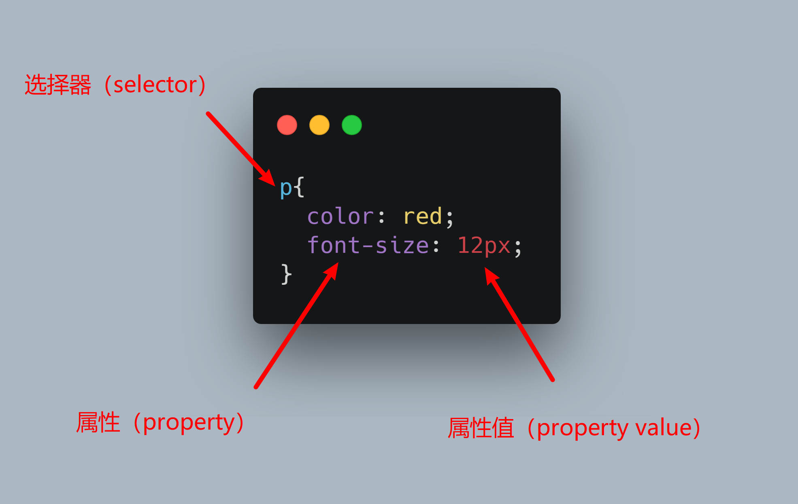

# css

1. css是干嘛的
2. css怎么使用？语法/子选择器/继承
3. 深入css：盒模型/文档流

## css是什么？

之前我们学习html的时候，学习到html是代表内容以及内容的结构。那么**css就是用来给内容增光添彩，增加样式的**。

css全称英文是 **`Cascading Style Sheets`**, 翻译成中文就是 `层叠样式表`。这个词看起来比较难以理解什么意思，我们不妨先欣赏一幅画：

* 层叠: 图里面有层叠的山峦。对于css来说，层叠指的就是不同内容的层次关系，就像这些山一样。
* 样式：不同的山，有不同的样子，有的山峰是尖的，有的山峰是圆弧的，有的山上有植被。
* 表：写出来的代码看起来很像填好的一张表格。

所以里面关键点有两个： `层叠` 和 `样式`。我们都知道一个网页的内容是由html元素组成的，css就是用来装扮这些html元素的，代表网页的**外观**。

**层叠代表html元素之间的位置关系，上下、左右、远近等等。**

**样式代表html元素自己的样子，大小、颜色、形状等。**

## css怎么用？

### 语法

css的语法非常简单，核心部分只有3个：选择器，属性，属性值。其他固定的格式有：一对花括号，属性和属性值之间的冒号，每一行属性设置完成之后在行末的分号。

下面分别解释一下含义：

* 选择器：选中要增加样式的html元素。这里会选中所有符合选择器的元素。在上面的例子会选中所有的 `p` 标签，无论有多少个都会一起选中。
* 属性：给选中的元素增加哪些样式。上图里的两个属性就是：字体颜色（color）和字体大小（font-size）
* 属性值：需要增加的样式设置的具体内容。上图里 `color` 的值是 `red` ，代表字体颜色设置为红色； `font-size` 的值是 `14px` ，代表字体大小设置为14个像素。

看起来是不是非常简单！

下面我们把css与上一章学过的html结合起来。

### html与css的结合

#### 方法1：

通过上面的代码可以看到，我们在html中插入了一个`style`标签，css的代码是放在`style`标签里的。这样我们就把html与css结合起来了，如果我们把这段代码保存到html文件中，在浏览器中打开以后，就能看到两行文字都变成红色的了。

#### 方法2：

让css文件独立出来，然后在html文件中引入这个css文件。

用这种方式修改之后的代码会变成下面的两段：

html文件中的`style`标签没了，变成了一个`link`标签，引入我们需要的css文件。

这里的css代码被独立放在`01.css`文件中。

以上这种方式的实际效果与第一种方法是一样的，但是多了一些好处：

我们把css代码放在专门的css文件中之后，就意味着这段代码可以被多个html文件引入了，所以聪明的小伙伴就可以把很多通用的样式放在这样一个文件中，然后给多个html文件使用。

而且，通过这种方式，我们还能够使用别人已经写好的样式，同样的我们的样式也可以被别人使用，这就意味着我们可以少做很多重复工作，节约很多时间。

### 多了解一点css选择器
关于css的选择器，刚才已经了解了一些，现在我们会了解更多一点。

上面有这样一段代码：

但是设想一下如果我们有10个 `p` 标签的内容，但是只希望其中某一些段落的字体是红色的，应该怎么办呢？目前上面这段代码会把所有的 `p` 标签字体颜色都设置为红色。

**css选择器有很多种！** 

不只html标签的名字可以作为选择器，html标签上的其他属性也是可以作为选择器的。以下面html代码为例子：

我们看到 `p` 标签上增加了 `class` 这个属性，它的值为 `red`。**`class`属性是可以作为选择器的！**

我们以class作为选择器的话，css代码长这个样子：

可以看到跟之前以标签作为选择器的时候写法略有变化：以class的值作为选择器的话，需要在前面加上 **`.`** 这个符号。

类似的，如果html标签中有 `id` 属性的话，我们也可以使用id作为选择器。当id作为选择器时，前面要加上 **`#`** 这个符号。

代码如下：

这个时候我们会发现一个问题，如果不同的选择器都选中了同一个元素应该怎么办呢？比如： `p` 和 `.red` 有重复选中的html元素，并且它们都给html元素设置了字体颜色，到底应该听谁的呢？

### 选择器的优先级
为了解决上面那个问题，css语言的设计者已经帮我们想好了办法：

**不同类型的选择器拥有不同的优先级，一般情况下，越具体的选择器优先级越高。**

