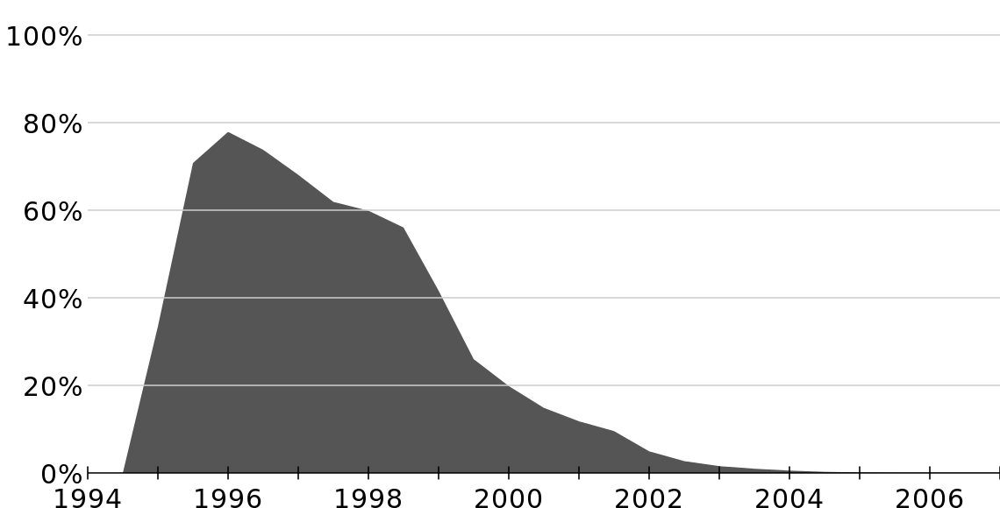

# JavaScript 历史

## 起源

JavaScript于1995年由Brendan Eich在Netscape（网景）公司工作时创建。这门语言受Java，scheme 和 Self语言启发。最初这门语言的设计初衷仅仅是为了提高表单验证的效率，当时多数的用户在使用28.8kbit/s的调制解调器上网，而互联网已经越来越流行，网站的功能越来越复杂，当用户在提交表单的时候，经常需要等待30秒才知道自己表单哪里填错了。

所以当时处于技术最前沿的Netscape公司，就考虑设计一种可以直接运行在浏览器上的语言，来协助完成一些简单的工作。这就是Javascript的由来。

当时的浏览器市场是Netscape Navigator的天下。下图是Netscape Navigator的市场占有率随年份变化图。

因为 JavaScript 1.0 如此成功，Netscape 在 Netscape Navigator 3.0 中发布了 1.1 版。恰巧那个时候，微软决定进军浏览器，发布了 IE 3.0 并搭载了一个 JavaScript 的克隆版，叫做 JScript（这样命名是为了避免与 Netscape 潜在的许可纠纷）。微软步入 Web 浏览器领域的这重要一步虽然令其声名狼藉，但也成为 JavaScript 语言发展过程中的重要一步。

## 三足鼎立

在微软进入后，有 3 种不同的 JavaScript 版本同时存在：Netscape Navigator 3.0 中的 JavaScript、IE 中的 JScript 以及 CEnvi 中的 ScriptEase。与 C 和其他编程语言不同的是，JavaScript 并没有一个标准来统一其语法或特性，而这 3 种不同的版本恰恰突出了这个问题。随着业界担心的增加，这个语言的标准化显然已经势在必行。

## 标准化

1997 年，JavaScript 1.1 作为一个草案提交给欧洲计算机制造商协会（ECMA）。第 39 技术委员会（TC39）被委派来“标准化一个通用、跨平台、中立于厂商的脚本语言的语法和语义”(http://www.ecma-international.org/memento/TC39.htm)。由来自 Netscape、Sun、微软、Borland 和其他一些对脚本编程感兴趣的公司的程序员组成的 TC39 锤炼出了 ECMA-262，该标准定义了名为 ECMAScript 的全新脚本语言。

在接下来的几年里，国际标准化组织及国际电工委员会（ISO/IEC）也采纳 ECMAScript 作为标准（ISO/IEC-16262）。从此，Web 浏览器就开始努力（虽然有着不同的程度的成功和失败）将 ECMAScript 作为 JavaScript 实现的基础。

