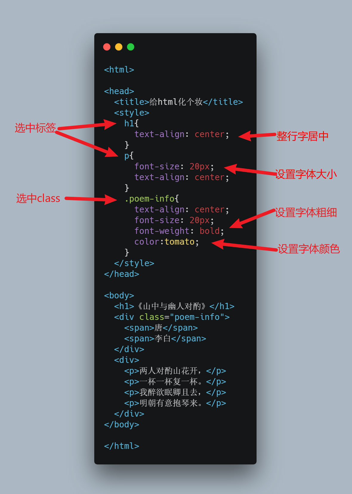

# Exercise 03 : 给html化个妆

前面的练习中，我们的html网页从外观上来看都是比较简陋的，现在我们学习如何给html进行美化。

首先大家把给下面这个例子创建一个新的html文件。

```html
<html>

<head>
  <title>给html化个妆</title>
  <style>
    h1{
      text-align: center;
    }
    p{
      font-size: 20px;
      text-align: center;
    }
    .poem-info{
      text-align: center;
      font-size: 20px;
      font-weight: bold;
      color:tomato;
    }
  </style>
</head>

<body>
  <h1>《山中与幽人对酌》</h1>
  <div class="poem-info">
    <span>唐</span>
    <span>李白</span>
  </div>
  <div>
    <p>两人对酌山花开，</p>
    <p>一杯一杯复一杯。</p>
    <p>我醉欲眠卿且去，</p>
    <p>明朝有意抱琴来。</p>
  </div>
</body>

</html>
```

我们观察一下这段代码跟第二个练习中的代码很像，但是多了一些内容。

首先我要解释一下新增的三个标签：

* head: 与 `body` 标签相应的，这是html文件的**头部**，这里放置的内容通常在网页中无法直观看到。
* title: 设置该html网页在浏览器中打开后，浏览器的标签页显示出来的标题。
* style: 当前练习的重点，里面的内容是给html的标签们，增加各种样式。

在 `style` 标签中新增了很多不一样的代码，这些代码都是用于改变下面各种标签的样式的。具体的规则如下：



总结一下给html标签加样式只需2步：

1. 选中某一类标签。选中标签有很多种写法，上面展示了两种：根据标签的名字选，根据class的名字选。
2. 增加自己想要的样式名称及其值（冒号之前是名称，冒号之后是值）。

## 练习

1. 用本节学到的新标签和样式美化自己的工作计划。