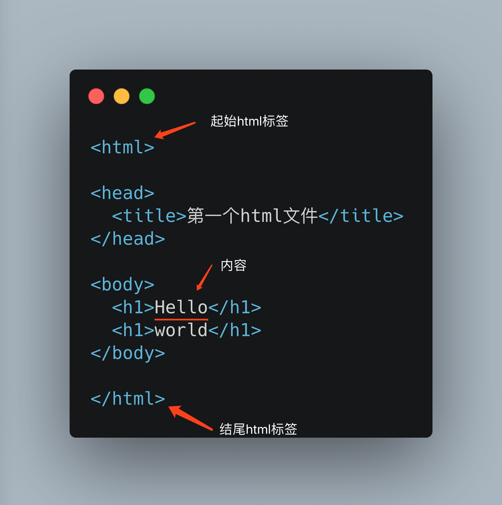

# Exercise 02 : html的标签

先解释一下什么是html标签：



观察一下规律：

* html标签都是成对的，包含一个开始标签和一个结束标签。
* 标签之间可以放置其他标签或者文字内容。
* 结束标签比开始标签多了 `/`

在上面图中一共出现了5个标签：

* html : 所有html网页最外层的标签，所有内容必须放在这一组标签之内，这个标签就好比一个完整的人一样。
* head : 当前html文件隐藏的内部信息通常都会放在这里，就像人的脑袋一样，你脑袋里在想什么别人是不知道的。
* title : 代表网页在浏览器中打开之后，标签页上面展示的文字，如下图所示。


* body : 通过名字可以看出来，这个标签的含义是当前html网页的“身体”，也就是代表当前展示在网页内所有的实际内容。
* h1 : 代表1级标题，我们使用word文档时候经常会见到这个选项。在h1之后还有 h2,h3,h4,h5,h6，最多到第6级标题。

介绍三个新标签：

```html
<p>段落标签 , p = paragraph</p>
<span>文字标签, 通常用来标记出一段有相同含义的内容</span>
<div>最通用的标签之一，没有特殊的含义，用来盛放其他标签或内容</div>
```

举个例子：

```html
<html>
  <body>
    <h1>《山中与幽人对酌》</h1>
    <div>
      <span>唐</span>
      <span>李白</span>
    </div>
    <div>
      <p>两人对酌山花开，</p>
      <p>一杯一杯复一杯。</p>
      <p>我醉欲眠卿且去，</p>
      <p>明朝有意抱琴来。</p>
    </div>
  </body>
</html>
```

这里我通过不同的标签把整首诗划分成了三个部分：`h1` 是诗的标题，第一个 `div` 里面是诗的相关信息，第三个 `div` 里面是诗的正文。

这里有一个关键的概念： **html是表示整个网页的内容和结构的。** 我要强调两个词： **内容** 和 **结构** 。大家仔细回顾一下上面这个例子，以及观察一下我为什么这样去使用这些标签。


### 练习

1. 在第一个 `div` 标签中我为什么用了两个 `span` ?
2. 使用现在已知的标签编写一个html网页，内容是自己未来1个月的工作/学习计划，计划至少要包含4部分内容：计划总标题，作者，周计划时间，周计划内容。


