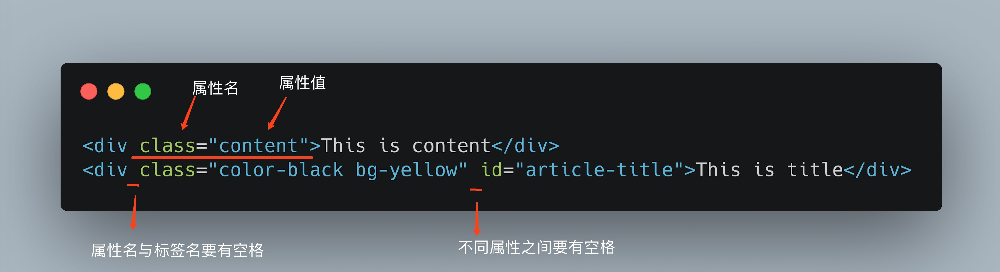

# html的标签的属性

什么是属性呢？属性是用来描述一个物体的特征的，比如一辆汽车的属性有：重量，长度，宽度，颜色，编号等等。具体的每一个属性的值是根据不同的汽车来确定的。比如：颜色这个属性可以有红色、黑色、白色等等多种取值。

对于html的标签来说，属性也是这个作用。下面看看属性的语法：



总结一下规律：
* 属性由 `属性名` + `=` + `"属性值"` 三部分组成，要特别注意的是属性名不需要用`""`给包裹起来，而属性值需要。
* 每一个标签可有多个不同的属性，属性和属性之间需要用空格进行区隔。
* 有的属性可以有多个属性值，有的属性只有一个属性值。
* 不同的属性作用不同。


```html
<html>
  <head>
    <title>标签的属性</title>
  </head>
  <body>

    <h1 class="poem-title">山中与幽人对酌</h1>
    <div class="poem-info">
      <span class="dynasty">唐</span>
      <span class="author">李白</span>
      <span id="poem-no">01</span>
    </div>
    <div class="poem-content poem-seven-words-quatrains">
      <p>两人对酌山花开，</p>
      <p>一杯一杯复一杯。</p>
      <p>我醉欲眠卿且去，</p>
      <p>明朝有意抱琴来。</p>
    </div>
  </body>
</html>
```

我们对上一节的示例进行了一些改动，有些标签多了属性`class`，这个属性的含义是标签的分类，它的取值可以有多个，就像描述一个人的性格可以是开朗、阳光、安静等多个词语组成一样。它其中一个作用是描述，当前这个标签里的内容是什么，比如 `class="poem-content poem-seven-words-quatrains"` 这里的属性值就描述了当前这个标签里包含的内容是这首诗的正文，而且这首诗是一首七言绝句。这样我们就很容易明白这个标签代表的含义了。

其中有一个标签增加了`id`这个属性，它的取值只能有一个，同时这个值本身在整个html文件中都必须是唯一的，像是每个人的身份证，如果这个标签在这个页面中是唯一的，通常用这个属性来表示。上面的例子中 `id="poem-no"` 那意味着，这个html文件中不应该再出现`id="poem-no"`的标签。


### 练习

1. 阅读 [class属性](http://www.w3school.com.cn/tags/att_standard_class.asp)和[id属性](http://www.w3school.com.cn/tags/att_standard_id.asp)，加强对属性的理解。
2. 修改上一节中的练习，为标签增加相应的属性，使得html代码含义更加明确。