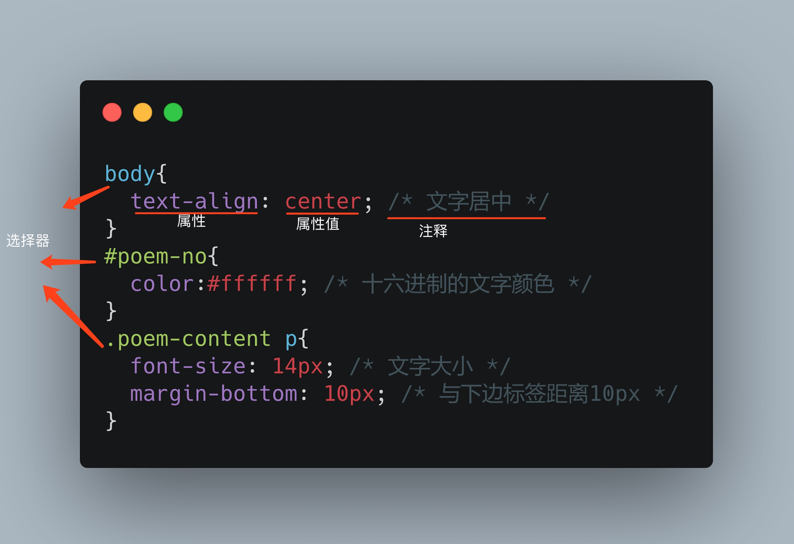

# 05 : 给html打扮一下

前面的练习中，我们的html网页从外观上来看都是比较简陋的，现在我们学习如何给html进行美化。

首先大家把给下面这个例子创建一个新的html文件。

```html
<html>

<head>
  <title>给html化个妆</title>
  <style>
    body{
      text-align: center; /* 文字居中 */ 
    }
    .poem-info{
      margin-top: 20px; /* 与上边标签距离20px */ 
    }
    .dynasty{
      color:cornflowerblue; /* 文字颜色 */ 
    }
    .author{
      color:gold;
    }
    #poem-no{
      color:#ffffff; /* 十六进制的文字颜色 */ 
    }
    .poem-content p{
      font-size: 14px; /* 文字大小 */ 
      margin-bottom: 10px; /* 与下边标签距离10px */
    }
  </style>
</head>

<body>
  <h1 class="poem-title">山中与幽人对酌</h1>
  <div class="poem-info">
    <span class="dynasty">唐</span>
    <span class="author">李白</span>
    <span id="poem-no">01</span>
  </div>
  <div class="poem-content poem-seven-words-quatrains">
    <p>两人对酌山花开，</p>
    <p>一杯一杯复一杯。</p>
    <p>我醉欲眠卿且去，</p>
    <p>明朝有意抱琴来。</p>
  </div>
</body>

</html>
```

上面这段代码新增加了一个`style`标签，先解释一下这个标签的用处：

* style: 里面的内容是设置html标签的样式，换句话说就是在这个标签之间的代码是**样式代码**，由于这里面使用的语言不是html语言，而是`css语言`，所以这是一段**css代码**。


### css语法

下面解释一下css代码的规则：




从图中可以看出，每一条css规则主要是由2部分组成：
* 选择器。作用是选中符合选规则的html标签，可能是单个或者多个，当前的样式规则只会在被选中的标签中生效。
* css属性和属性值的组合。给选择器选中的标签增加样式。

### 单个选择器类型

图中展示了三种基础的选择器写法：

* 标签选择器：直接使用标签名作为选择器。
* id选择器：格式为`#id-name`，选中属性含有`id="id-name"`的标签。
* class选择器：格式为`.class-name`，选中属性含有 `class="class-name"` 的标签。

### 多级选择器

以下面这个选择器举例：

```css

.poem-content p{}

```
我们发现这里的选择器实际上由两个选择器组成： `.poem-content` 和 `p`，它们组合起来的意思是：选中 `class="poem-content"`标签下的所有`p`标签。


## 练习

1. 改动本节中的诗歌示例，修改css规则，比较 `.poem-content p` 与 `p` ，`.poem-info span` 和 `.dynasty` 之间的区别。
   
2. 用本节学到的css美化自己的上一节的工作计划练习。