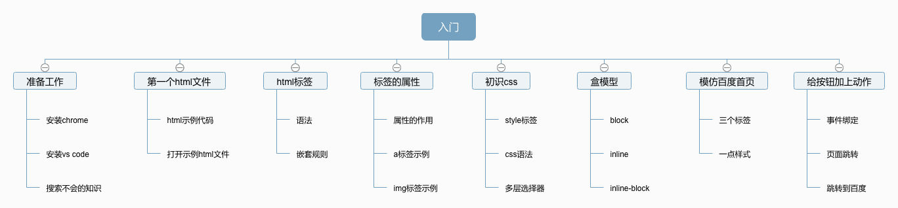
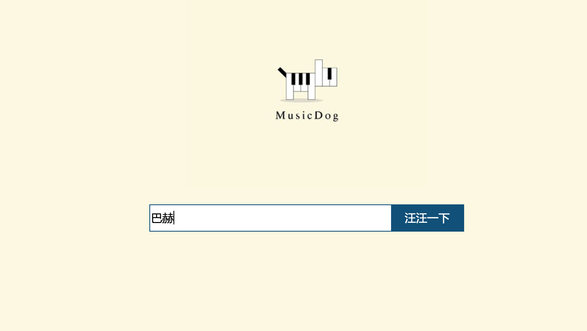
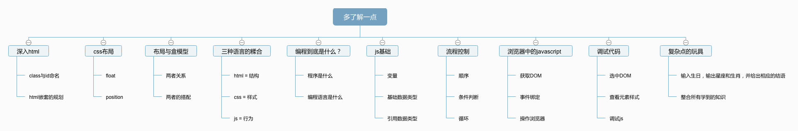

首先要声明的是，本篇的学习路线不包含如何进阶成高级前端开发，只包括初中级。

## 学习方式

对于0基础的同学，我理解是对于编程完全0基础的人，最适合的学习形式是：**先练后学，再学再练**。

这里面的关键点是**先练后学**，意思就是先对着教程的示例代码直接上机实践，而不是先搞懂理论层面的东西：比如语法、运行原理、含义等等。这个过程**不能对示例代码进行复制粘贴，务必自己动手一行行地把代码敲出来。**

采用这种方式的特点是，很像我们小时候玩玩具，比如：玩积木。一开始可能我们只是随便堆放，没有人告诉我们任何原理，在这个动手的过程中自己逐渐发现规律找到乐趣。然后再去学习相关的理论知识就会非常有效，也不会一开始就被枯燥的理论知识搞的丢失兴趣。

## 学习路线

### 核心思路

前端开发的三驾马车： `html` + `css` + `javascript` 。通常的学习路线都是先`html`，然后`css`，最后`javascript`。但我个人认为这个学习路径效率比较低，对新手尤为不友好。

我的想法： `html` 和 `css` 不分家，然后 `javascript` 在 `html` 和 `css` 都有一定了解之后便可以开始学习，原因是这样既可以让学习者迅速感知到前端开发的有趣之处，又可以促进理解这三者之间的关系。

### 从0到初级

#### 入门阶段

在这个阶段的初学者，基本上是一片空白，所以任务就是**照着例子抄，摸对前端的感觉**。

下面这个图是我认为的一个合适的学习思路：没有过多的理论知识，避免对编程的压力，避免初学者看到很多从来没见过的各种单词、符号觉得头疼，**学习者边抄代码，边思考，边观察，养成玩代码的乐趣**。

最终这个阶段结束的时候应该可以产出自己第一个小玩意，大概如下图，只有非常简单的html+css+js，但是是一个可以使用的玩具，点击搜索以后直接跳转到百度的搜索页面，且会带上关键词。

#### 进阶阶段

这一阶段的目标是对整个前端知识再进一步了解，同时要创造出更复杂一点的“玩具”。在这个阶段里有三个关键点跟上一个阶段不同：

1. 理解更多理论知识。需要阅读更多相关技术书籍或者文章。
2. 从**被扶着走**转变为**自己走**。比如：学习调试、主动用搜索引擎帮助自己去解决疑惑。
3. 介入计算机基础。编程的基石，不论是什么岗位的程序员都应该了解的知识，但是这个阶段没有必要去深入这些知识，只需要有一定了解就够。

这个阶段度过之后，我认为可以算得上半只脚入门了。

#### 渡劫阶段

