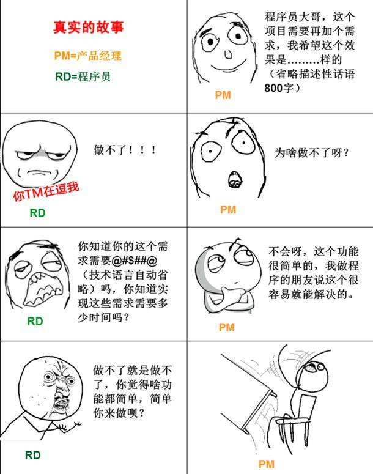
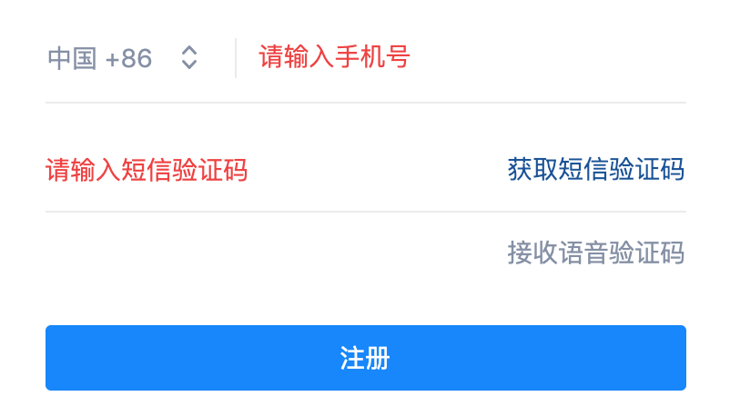
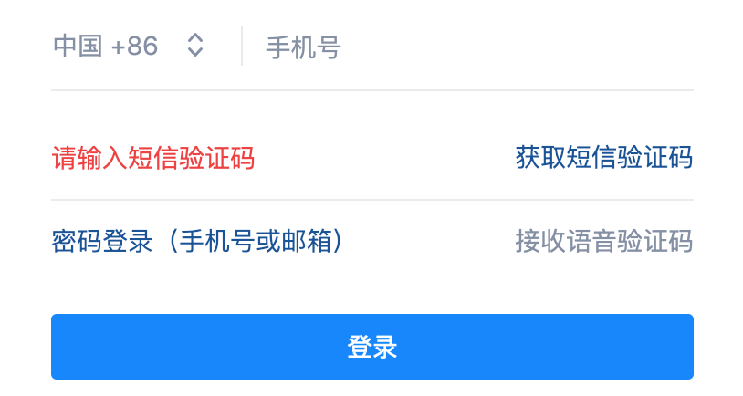
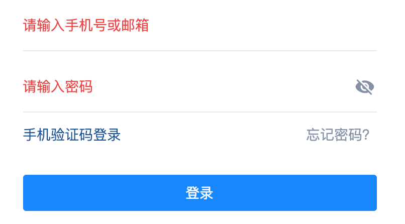

# 情景重现

### 产品核心质疑：
* 这个需求这么简单，你为什么不想改？
* 改这点东西，居然需要5天？你个骗子！

### 开发核心质疑：
* 你怎么又改？！
* 改这个要5天就没跟你多说，你居然还嫌多？！

### 核心矛盾：
* 需求（包括新需求和改动）的原因
* 开发的成本
* 需求上线后结果
* 关注点不同：研发关注性能，产品关注产出。

# 产品的开发流程：


### 开发的核心环节：
* 前后端开发
* 测试

### 前端开发的主要工作内容：
* 界面
* 交互

### 后端开发的主要工作内容：
* 数据库
* 业务逻辑

以登录注册举例：
PC网站，登录注册只能用邮箱，然后要增加手机登录注册功能。

示意图如下：

手机注册：

手机+验证码登录

密码登录

可能由此需求需求引起的其他需求：
* 用户修改绑定手机号
* 通过手机验证码方式修改登录密码
* 如果有用户搜索功能，要支持邮箱及手机号都能搜索到

技术人员最少要进行的工作：

前端（2PD）：
* 新增界面样式
* 新旧界面切换
* 输入内容校验
* 调用登录/注册接口

后端（3PD）：
* 修改数据库的用户表
* 修改用户基础信息底层接口
* 修改现有登录/注册接口
* 新增发送短信验证码接口

测试（3PD）：
* 测试登录及注册所有流程
* 测试界面在各个浏览器和操作系统下的兼容性
* 测试所有与用户信息相关的接口

共计需要8PD，最快速度从开始开发到上线也需要6PD。

新手可能会说2天就够了！！

参考一下后端服务逻辑图：

# 修改一个需求的成本

内容来自《代码大全》这本书。

# 常见技术词汇

接口/API : 就像功能的开关，比如：开关灯。

数据库： 如果数据是水，数据库就是水库。

内部服务：代码是我们自己写的，能够控制，放心吧老铁。

外部服务：代码是别人的，还要跟别人沟通和调试，耗时较长。

写死的（静态的）：写在前端代码里的内容，必须通过发布代码才能改变。

没写死的（动态的）：内容是从接口获取到的，不需要重新发布代码可以随时改变的，通常会有配套的后端管理系统。

# 问题分类统计

1. 开发流程
   1. 前后端配合
   2. 测试流程
   3. 发布流程
2. 产品需求
   1. 漏需求
   2. 逻辑不通
   3. 功能是否能实现
3. 产品需要知道的技术点
4. 产品与研发的协作与沟通
   1. 需求评审
   2. 开发排期的确定
   3. 项目管理
   4. 加班赶进度
5. 数据库
6. AI和大数据
7. 技术相关（害怕被研发坑）
   1. 术语（框架，服务，接口，数据库，数据表）
   2. 基础技术
   3. 数据埋点及分析

