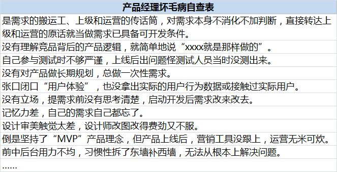
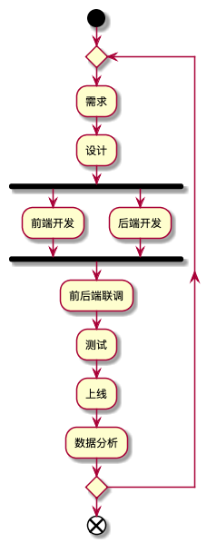
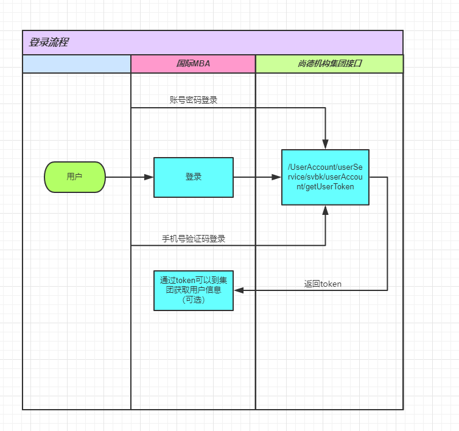
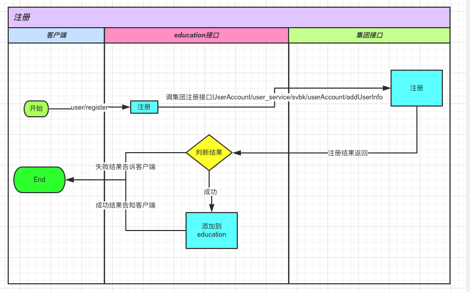
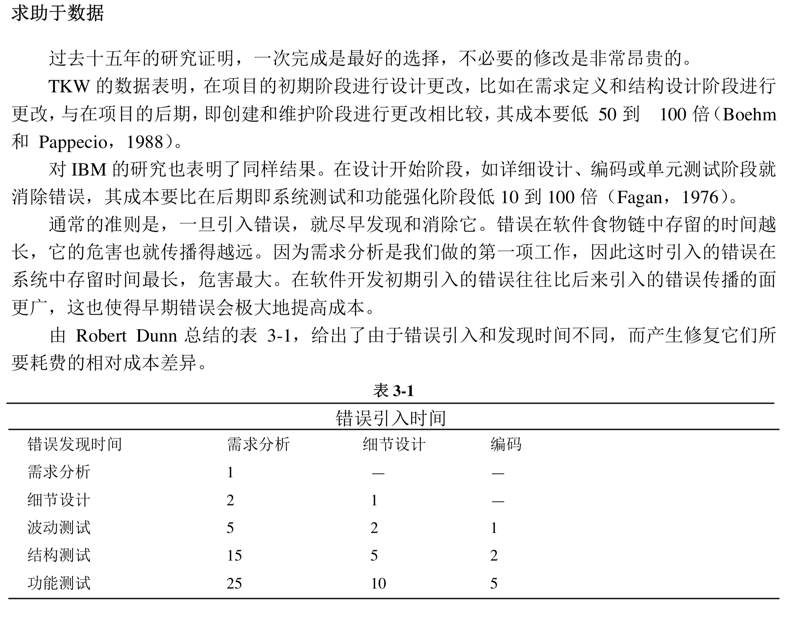

# 情景重现

### 产品核心质疑：
* 这个需求这么简单，你为什么不想改？
* 改这点东西，居然需要5天？你个骗子！
* 这个项目周五上线，你看看需要几天？

### 开发核心质疑：
* 你怎么又改？！
* 改这个要5天就没跟你多说，你居然还嫌多？！
* 周五上线你问我需要几天？！

### 核心矛盾：
* 需求（包括新需求和改动）的原因
* 需求开发的成本
* 需求上线后结果

### 关注点不同：
  * 研发关注：
    * 代码怎么写
    * 新代码是否会影响旧代码
  * PM关注：
    * 需求能否快速上线
    * 上线后效果

### 现实问题：研发与PM的绩效不一样啊：

* 研发的绩效：系统的稳定性，系统响应速度，bug多不多等等
* PM的绩效：新上了哪些项目，新增多少用户，留存有没有提高等等

从绩效的角度来看，双方天生矛盾：

对于研发来说，做的慢 = 质量好 + 速度快

对于PM来说，做的快 = 更多的试验机会 + 用户的增长空间

### 站在更高的角度看待上面的矛盾

假设你是公司CEO，你会如何看待上面的问题？

这个问题本质上是：一个项目 / 一个部门 / 一家公司 在当下这个阶段的发展侧重问题。

* 初创阶段：追求用户数量，可以舍弃一定的系统质量去迅速抢占市场。
* 发展中阶段：用户增长速度放缓，这时既要保证系统质量，也要保证用户增长。
* 成熟阶段：追求用户留存/日活等，这个时候对于系统质量要求非常高，对于产品功能的新增或者改变会很谨慎。

### 学技术的误区：
* 学技术防怼 （x）
* 学技术防坑 （x）
* 学技术聊的好 （x）

**你的产品属于什么阶段？**
**如何让研发与你的目标一致？**

# 项目的开发流程：


### 开发的核心环节：
* 前后端开发
* 测试

### 前端开发的主要工作内容：
* 界面
* 交互

### 后端开发的主要工作内容：
* 数据库
* 业务逻辑

以登录注册举例：
PC网站，登录注册只能用邮箱，然后要增加手机登录注册功能。

示意图如下：

手机注册：

手机+验证码登录

密码登录

可能由此需求需求引起的其他需求：
* 用户修改绑定手机号
* 通过手机验证码方式修改登录密码
* 如果有用户搜索功能，要支持邮箱及手机号都能搜索到

技术人员最少要进行的工作：

前端（2PD）：
* 新增界面样式
* 新旧界面切换
* 输入内容校验
* 调用登录/注册接口

后端（3PD）：
* 修改数据库的用户表
* 修改用户基础信息底层接口
* 修改现有登录/注册接口
* 新增发送短信验证码接口

测试（3PD）：
* 测试登录及注册所有流程
* 测试界面在各个浏览器和操作系统下的兼容性
* 测试所有与用户信息相关的接口

共计需要8PD，最快速度从开始开发到上线也需要6PD。

新手可能会说2天就够了！！

参考一下后端服务逻辑图：

# 修改一个需求的成本

内容来自《代码大全》这本书。

# 常见技术词汇

接口/API : 就像功能的开关，比如：开关灯。

数据库： 放数据的仓库。如果数据是水，数据库就是水库。

服务：按某种维度划分的功能的集合。比如，去餐厅吃饭，做饭服务的是厨师，上菜服务的是传菜员，接待服务的是接待员等等。往大看，餐厅本身也是一种服务，更高维度的服务；往小看，做饭的厨师还有面点厨师、川菜厨师等等。

写死的（静态的）：写在前端代码里的内容，必须通过发布代码才能改变。

没写死的（动态的）：内容是从接口获取到的，不需要重新发布代码可以随时改变的，通常会有配套的后端管理系统。

A/B test：让一部分用户用到新版本。

# 大数据和AI

大数据 = 储存很多数据

AI = 从数据里找规律

# 问题分类统计

1. 开发流程
   1. 前后端配合
   2. 测试流程
   3. 发布流程
2. 产品需求
   1. 漏需求
   2. 逻辑不通
   3. 功能是否能实现
3. 产品需要知道的技术点
4. 产品与研发的协作与沟通
   1. 需求评审
   2. 开发排期的确定
   3. 项目管理
   4. 加班赶进度
5. 数据库
6. AI和大数据
7. 技术相关（害怕被研发坑）
   1. 术语（框架，服务，接口，数据库，数据表）
   2. 基础技术
   3. 数据埋点及分析

